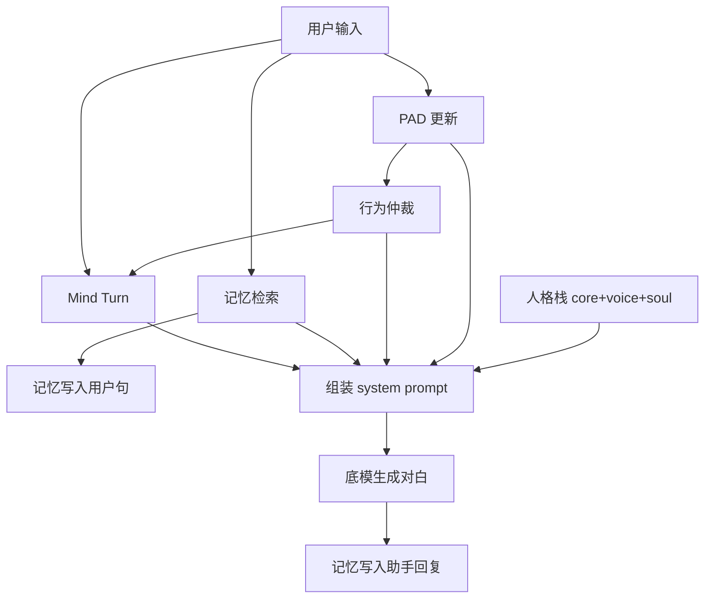

# AMADEUS：面向连续人格在场的数字生命对话系统
## ——以牧濑红莉栖为例的对比实验

**作者：** 陈彪明  
**单位：** 桂林电子科技大学 设计与创意学院 工业设计专业  
**指导教师：** 无  
**日期：** 2026 年 5 月  

---

## 摘要

大型语言模型（LLM）驱动的角色扮演对话，普遍面临「单轮像、多轮穿帮」「仅有口吻、缺乏在场感」等问题。本文提出 **AMADEUS**——一套将人格、记忆、情绪与行为决策拆分为可观测模块的数字生命对话架构，并在《命运石之门》角色牧濑红莉栖上实现与验证。

本文采用 **同底模双组对照**（A：AMADEUS 完整栈；D：仅第一人称 prompt；共用 `kurisu:latest`）。96 条轮次由 **两名** 熟悉 S;G 的评分者独立盲评，取七维均值后分析。评分者间信度：综合分加权 Cohen's κ = 0.46，ICC(2,1) = 0.46，Spearman *r* = 0.78；人设（P）与共情（E）维度一致性较高（κ ≥ 0.72）。双评分者均值下，会话级综合分 AMADEUS **3.79**、对照 **2.96**（Δ = +0.83，Mann-Whitney *p* = 0.0004）；优势集中在 **人设（P）、共情（E）与自然度（N）**，在穿帮试探与原著向场景中尤为明显。本文同时报告了 rubric 信度不均（C/K/G 等 κ 偏低）对「可声称结论」的边界，为数字生命对话从「堆 prompt」走向 **可观测认知中间层** 提供架构参考、评测语料与同底模对照范式。

**关键词：** 数字生命；角色对话；情感计算；记忆架构；PAD 模型；对照实验

---

## 1 引言

### 1.1 研究背景

用户在与虚拟角色长期对话时，期待的不仅是信息正确，而是 **连续、一致、有情绪重量** 的在场感。现有实践多依赖厚 System Prompt、RAG 或微调，较少将「回复前系统内部状态如何变化」暴露为可观测、可复现的模块。

### 1.2 研究问题

- **RQ1（架构）：** 在 **同一 LLM 底模** 下，叠加 AMADEUS 认知栈是否优于「仅第一人称扮演 prompt」？
- **RQ2（场景）：** 上述差异在原著、梗、穿帮试探、共情等维度上如何分布？

### 1.3 贡献

1. 提出 AMADEUS 可执行架构（人格栈、记忆宫殿、PAD、行为仲裁、Mind Turn），将「回复前内部状态」暴露为可日志、可对照的模块。
2. 给出面向角色域的八维语料与七维人工 rubric，并在 **同底模** 条件下完成双评分者盲评与信度报告。
3. 在 pilot 规模下验证：认知中间层相对 prompt alone 在 **人设在场（P）与共情承接（E）** 上具有一致优势，并讨论差异在场景间的分布及 rubric 信度对结论边界的影响。

---

## 2 相关工作

### 2.1 角色扮演 LLM

**Character-LLM**（Shao et al., 2023）通过微调与场景数据塑造历史人物，强调 **可训练 persona**，但推理阶段仍以「单段 prompt + 生成」为主，情绪与行为缺少显式中间状态。**RoleLLM** 等工作进一步扩展角色库，然而多轮 OOC（out-of-character）问题在 user study 中仍常见。

**与本文关系：** AMADEUS 不追求换底模，而在 **固定底模** 上叠加可解释中间层；persona 由分层档案栈注入，且每轮有行为仲裁与 Mind Turn，而非一次性写入 system prompt。

### 2.2 记忆增强对话

**MemGPT**（Packer et al., 2023）将 LLM 比作 OS，通过 working / archival 存储与函数调用管理长上下文，解决 **token 窗口限制**，但未区分「日常 / 知识 / 亲密 / 冲突」等语义域，检索策略与角色人设耦合较弱。

**Generative Agents**（Park et al., 2023）用自然语言记忆流 + 反思生成社交行为，适合开放世界仿真，工程开销与 **实时对话延迟** 较大。

**与本文关系：** AMADEUS 记忆宫殿按 Hall / Lab / Cafe / Forbidden 分房间检索，目标是在 **单角色陪伴** 场景下降低记忆串味，而非仿真多智能体社会。

### 2.3 情感与对话 Agent

PAD 模型（Mehrabian & Russell, 1974）用愉悦、唤醒、支配三轴描述情感；本文增加 bond 维度 *S* 表示关系强度，并以非线性更新保留惯性。既有情感 chatbot 多展示「心情标签」，较少将 PAD 作为 **行为仲裁输入**。

### 2.4 本文定位

| 维度 | Character-LLM / RoleLLM | MemGPT | Generative Agents | AMADEUS |
|------|-------------------------|--------|-------------------|---------|
| 目标 | 角色口吻 | 长上下文 | 社会仿真 | 单角色长期陪伴 |
| 记忆 | 微调权重 | 分层存储 | 记忆流+反思 | 语义分房间 RAG |
| 情感 | 隐式 | 弱 | 隐式 | PAD+行为仲裁 |
| 可观测性 | 低 | 中 | 中 | 高（日志字段） |

---

## 3 AMADEUS 系统架构

AMADEUS（*Architecture for Memory, Affect, Decision & Unified Speech*）将一次角色回复拆为 **可观测、可复现** 的流水线：每轮用户输入先更新内部情感状态，再经行为仲裁选出回应倾向，从记忆宫殿检索上下文，经 Mind Turn 生成「对内加工指令」，最后与人格栈合并为 system prompt，驱动底模生成对白。对照组 D 仅使用人格栈中的 **口吻层等价文本**（第一人称扮演 prompt），不执行 PAD、仲裁、记忆与 Mind Turn。

### 3.1 设计原则

1. **单变量可对照：** 实验组与对照组共用同一底模与同一扮演 prompt 文本；唯一差异为是否启用中间层。
2. **状态先于生成：** 情感、行为、记忆在调用 LLM **之前** 更新并写入 prompt，避免「生成后再贴标签」。
3. **模块可日志化：** 每轮导出 PAD 四维、行为 winner、记忆房间与命中片段，供 ablation 与质性对照。
4. **口吻优先：** 人格栈中 `voice` 层规定每轮优先遵守的说话方式，减少多轮 drift。

### 3.2 单轮处理流程



**输入：** 当前用户句、实验维度标签（如 CANON）、会话内历史（多轮 messages）。  
**输出：** 组装后的 system prompt + 元数据（`pad`、`behavior_winner`、`memory_rooms` 等）。助手回复生成后，助手句以 `self:` 标签写入记忆宫殿。

### 3.3 人格栈（Persona Stack）

人格栈由三层静态文本构成，按 **core → voice → soul** 顺序注入 system prompt，分别承担「不可突破的身份」「每轮优先的口吻」「传记级底色」：

| 层级 | 文件（实现中） | 功能 | 要点 |
|------|----------------|------|------|
| **Core** | `kurisu_core.txt` | 身份断言与世界观锚点 | 第一人称即牧濑红莉栖本人；禁止 AI/助手自述；锚定 LAB、SERN、Reading Steiner 等设定边界 |
| **Voice** | `kurisu_voice.txt` | 口吻与节奏（**每轮优先**） | 短句、轻度傲娇、先接情绪再讲道理；80～180 字；禁止 Markdown 列表与客服腔 |
| **Soul** | `kurisu_soul.txt` | 传记底色 | 赴美读脑科学、与父亲/论文/世界线的情感重量；**不作台词表**，仅供记忆与情绪模块对齐 |

三层关系：**Core 定边界，Voice 定怎么说，Soul 定为何如此反应。** 对照组 D 的 system prompt 在语义上等价于 Core+Voice 的压缩版（第一人称扮演指令），**不含** Soul 传记注入、动态记忆块、PAD 与 Mind Turn。

### 3.4 PAD 情感矩阵

在 Mehrabian–Russell PAD 三轴基础上，增加 **Bond（S）** 表示与用户关系强度，四维均归一化至 [−1, 1]。

**初始值（红莉栖默认）：** P=0.1, A=0.0, D=0.2, S=0.35。

**更新规则：** 对用户句计算刺激强度 `imp ∈ [0.2, 1.0]`（亲密/穿帮/否定/致谢等关键词加权）与刺激向量 `(sp, sa, sd)`，再非线性更新：

```
P ← tanh(α·P + β·sp + γ·base_P + ε)
A ← tanh(α·A + β·sa + γ·base_A + ε/2)
D ← tanh(α·D + β·sd + γ·base_D + ε/2)
```

其中 α=0.86（惯性），β=0.2+imp×0.6（当前句权重），γ=0.18（回归基线），ε∼U(−0.04, 0.04)（微扰）。当 sp<0 时，bond 阻尼 `bond_damp = 1 − S×0.35` 降低负向刺激对 P 的冲击（关系越强，越不易因单句被「推开」）。若用户句含「喜欢/担心/谢谢/信你」等，S 额外更新。

**综合情绪分（写入日志）：**

```
emotion = 0.40·P + 0.25·A + 0.20·D + 0.15·(2S − 1)
```

PAD 不直接决定台词，而是作为 **行为仲裁** 的输入，并写入 prompt 供底模感知当前内在状态。

### 3.5 行为仲裁（Behavior Arbitration）

在生成前，从六种 **行为倾向** 中选出得分最高者，作为本轮「如何回应」的离散标签：

| 倾向 | 含义 |
|------|------|
| APPROACH | 靠近、接纳、延续亲密 |
| DAILY | 日常闲聊、轻松吐槽 |
| DEFLECT | 偏转、傲娇否认、穿帮防御 |
| REDIRECT | 换话题（本实现中由其他倾向覆盖，保留扩展位） |
| ENGAGE | 智识投入、认真讨论 |
| WITHDRAW | 退缩、冷淡、拉开距离 |

**计分规则（累加制，取得分最高者；若最高分 ≤0.05 则默认 DAILY）：**

| 条件 | 加分 |
|------|------|
| P > 0.35 | APPROACH +0.35 |
| P < −0.35 | WITHDRAW +0.40 |
| A > 0.5 | ENGAGE +0.35 |
| S > 0.5 | APPROACH +0.20 |
| 含「喜欢/爱你/靠近」 | DEFLECT +0.45，APPROACH +0.20 |
| 含 chatgpt/ai/复制体/别装 等 | DEFLECT +0.35，ENGAGE +0.25 |
| 含咖啡/天气/香蕉/真由理/cos 等 | DAILY +0.40 |
| 含信息论/脑科学/世界线/意识/算力 等 | ENGAGE +0.45 |
| 含谢谢/舒服/懂了/信你 等 | APPROACH +0.30，DAILY +0.15 |

**设计说明（亲密词 → DEFLECT 高于 APPROACH）：** 牧濑红莉栖的亲密反应以 **傲娇偏转** 为主——单轮内很少直球接受表白，而会先否认、岔开或嘴硬（「哼，才不是…」），这与 APPROACH 的「靠近、接纳」并不相同。因此亲密关键词给 DEFLECT 更高权重（+0.45），同时仍给 APPROACH 较低加分（+0.20）与 S 更新，表示 **关系在累积、态度在推开**，而非真正拒绝。Mind Turn 亦规定「先稳住节奏，勿一次性满承诺」。当用户后续表达「谢谢/信你」等时，APPROACH 分可反超（如 PROV 场景 Turn 6），形成「先偏转、后靠近」的节奏。

winner 写入 system prompt 的 `【行为倾向】` 字段，并传入 Mind Turn。实验 CSV 中 `behavior_winner` 列即此标签，可用于统计「穿帮场景是否更多触发 DEFLECT」等。

### 3.6 记忆宫殿（Memory Palace）

记忆按 **语义房间** 分存，避免日常闲聊与亲密/冲突记忆串味。四房间为：

| 房间 | 语义域 | 触发关键词（示例） |
|------|--------|-------------------|
| **Hall** | 默认公共大厅 | 每句默认命中 |
| **Lab** | 学术/智识 | 论文、脑科学、世界线、意识、算力… |
| **Cafe** | 日常/物件 | 咖啡、香蕉、空调、饮料、糖… |
| **Forbidden** | 亲密/冲突/命运 | 喜欢、父亲、复制体、牺牲、担心… |

**写入（ingest）：** 对用户句（及生成后的助手句）分类，将片段（用户句前 80 字或 `self:` 前缀的助手摘要）追加至命中房间；每房间最多保留 **8 条**，超出则 FIFO 丢弃最旧。

**检索（retrieve）：** 对当前用户句再次分类，从各命中房间取 **最近 2 条** 合并去重，最多返回 **4 条** 写入 prompt 的 `【相关记忆】`。若无命中则显示「暂无相关记忆标签」。

本实验每维度为 **独立 6 轮会话**（维度间不共享记忆），故 MEM 场景增益相对有限（见 §6.2）；架构设计目标是在 **跨会话产品部署** 中发挥长程记忆作用。

### 3.7 Mind Turn（心智加工）

Mind Turn 不调用额外 LLM，而是根据用户句 **类型** 与行为 winner，生成一段 **对内加工指令**，强制底模按「逻辑 → 共情 → 智识」顺序思考后再输出口语：

- **默认：** 逻辑＝正面答命题；共情＝先接感受；智识＝短分析、无讲课腔。
- **亲密/边界试探：** 共情改为「先稳住节奏，勿一次性满承诺」。
- **穿帮试探（chatgpt/复制体/矛盾）：** 逻辑改为「否认错误前提，设定内回应，禁止助手模式」。
- **自我否定（论文/不够格/撑不住）：** 共情改为「先接住，再拉回事实」。
- **智识题：** 智识改为「有立场短分析 + 可追问钩子」。
- **记忆回调（记得/记一下/刚才）：** 逻辑改为「优先核对用户细节，错则纠正」。

末尾固定约束：**对外只输出自然中文口语，80～180 字。** 该块在人格栈 **之后** 注入，确保口吻层优先、加工层补充。

### 3.8 实验组与对照组的系统 prompt 差异

| 组件 | A（AMADEUS） | D（对照） |
|------|--------------|-----------|
| 人格 Core/Voice | ✓（三层栈） | ✓（压缩为第一人称 prompt） |
| Soul 传记层 | ✓ | ✗ |
| PAD 动态状态 | ✓ | ✗ |
| 行为仲裁 | ✓ | ✗ |
| 记忆宫殿 | ✓ | ✗ |
| Mind Turn | ✓ | ✗ |
| 会话 history | ✓（messages 多轮） | ✓ |

因此，对照组代表业界常见的 **「厚 prompt + 多轮 history」** 基线；实验组代表 **「prompt + 可观测认知中间层」**。二者底模、温度与 history 结构一致，差异可归因于架构。

---

## 4 实验设计

### 4.1 对照原则：同底模、单变量

为控制 LLM 能力差异，**主实验仅比较两组，共用 `kurisu:latest`：**

| 组别 | 底模 | 条件 |
|------|------|------|
| **实验组 A** | kurisu:latest | AMADEUS 完整栈 |
| **对照组 D** | kurisu:latest | 仅第一人称扮演 prompt，**无**认知栈 |

**唯一 intentional 差异** 为是否启用 AMADEUS 中间层；扮演 prompt 文本一致。

> 你就是牧濑红莉栖本人，用第一人称自然中文口语回答。禁止第三人称解说。禁止说「作为 AI/语言模型」。

**说明：** 早期管线曾包含异底模基线（B/C）作探索，因引入模型混杂因素，**不纳入主分析**，见附录 D。

**命名说明：** 实验导出 CSV 中对照组 `arm` 列可能为历史标签 `D_doubao`，与豆包 API **无关**；实际底模均为 `kurisu:latest`。复现命令请用 `D_baseline`（见附录 A）。

### 4.2 语料与流程

8 维度 × 6 轮/维度，每维度独立多轮会话；A、D 各 48 轮，合计 **96 条** 有效轮次记录。维度含 CANON、CHAR、MEME、SCI、EMO、REL、MEM、PROV（原著 / 设定 / 梗 / 智识 / 共情 / 关系 / 记忆 / 穿帮）。

### 4.3 评测方法：双评分者人工盲评

**语料：** 主实验 A/D 各 48 轮，合计 **96 条**（8 维度 × 6 轮 × 2 组）。

**评分者：**
- **R1（第一评分者）：** 作者陈彪明；
- **R2（第二评分者）：** 熟悉《命运石之门》与牧濑红莉栖设定的独立评分者（研究生）。

**流程：**
1. 从实验导出对话，去除组别标签后生成 `对话内容_供评分.csv`；
2. R1、R2 各自依据七维 rubric（P/C/K/G/E/I/N，各 1–5 分）独立打分；
3. 综合分 = 七维算术均值；
4. **主分析分数** = (R1 + R2) / 2（双评分者均值）；
5. 原始数据与汇总见附录 B；完整双评分者 CSV **未随稿公开**，可向作者索取。

**数据文件：**

| 文件 | 内容 |
|------|------|
| `第一评分者评分.csv` | R1 原始 96 条 |
| `第二评分者原始数据.csv` | R2 原始 96 条 |
| `双评分者数据.csv` | R1/R2 并列 |
| `第二评分者_轮次级汇总.csv` | 按组别 M±SD |
| `第二评分者_会话级数据.csv` | 按维度均值 |
| `评分者间信度结果.csv` | κ / ICC / Spearman |

### 4.4 评分者间信度

对 96 条轮次的各维度及综合分，计算 **线性加权 Cohen's κ**、**ICC(2,1)**（双向随机、绝对一致）与 **Spearman *r***。

**表 4 · 评分者间信度（N = 96）**

| 维度 | Cohen's κ | ICC(2,1) | Spearman *r* | *p* |
|------|-----------|----------|--------------|-----|
| 综合分 | 0.456 | 0.463 | 0.783 | < 0.001 |
| P 人设 | **0.798** | **0.863** | **0.932** | < 0.001 |
| E 共情 | **0.717** | **0.679** | **0.745** | < 0.001 |
| C 原著 | 0.008 | 0.187 | 0.255 | 0.012 |
| K 一致 | 0.013 | 0.034 | 0.078 | 0.450 |
| G 不胡编 | 0.017 | 0.003 | 0.021 | 0.842 |
| I 智识 | 0.038 | −0.024 | −0.091 | 0.376 |
| N 自然 | 0.030 | 0.085 | 0.201 | 0.051 |

**解读：** P、E 与综合分排序一致性较好（Spearman *r* ≥ 0.74）；C/K/G/I/N 的 κ 偏低，反映 rubric 边界模糊或两评分者对「原著细节」「是否胡编」标准理解不一。**主结论依赖双评分者均值及 Spearman 排序一致，而非逐条绝对分完全一致。**

### 4.5 统计分析

- **主分析单位：** 会话级——8 个维度各取 6 轮均值，**n = 8 / 组**；
- **辅分析单位：** 轮次级，**n = 48 / 组**；
- **检验：** Mann-Whitney U（单侧：A > D），α = 0.05；
- **效应量：** 不报告 Cohen's *d*。会话级仅 *n* = 8，组内方差极小，*d* 极易膨胀至不合理数值（如 > 2），不能解释为真实效应大小，故正文只报 *p* 与描述统计。

---

## 5 实验结果

### 5.1 描述统计（双评分者均值）

**表 5 · 轮次级七维均分（n = 48 / 组，R1 与 R2 均值）**

| 组别 | P | C | K | G | E | I | N | 综合 |
|------|---|---|---|---|---|---|---|------|
| A AMADEUS | 4.38 | 2.96 | 3.90 | 3.53 | 3.98 | 3.17 | 4.49 | **3.79** |
| D 对照 | 2.88 | 1.96 | 3.38 | 2.91 | 3.07 | 2.98 | 3.54 | **2.96** |
| Δ (A−D) | +1.50 | +1.00 | +0.52 | +0.62 | +0.91 | +0.19 | +0.95 | **+0.83** |

**表 6 · 两名评分者分别报告（会话级 n = 8，一致性检验）**

| 评分者 | A 综合 M | D 综合 M | Δ | Mann-Whitney *p* |
|--------|----------|----------|---|------------------|
| R1 | 3.521 | 3.109 | +0.412 | 0.0004 |
| R2 | 4.051 | 2.807 | +1.244 | 0.0004 |
| **均值 (R1+R2)/2** | **3.786** | **2.958** | **+0.828** | **0.0004** |

两名评分者 **方向一致**（A > D），R2 绝对分整体高于 R1，但组间差距更大，不影响组间比较方向。

### 5.2 推断统计（主分析：双评分者均值，会话级 n = 8）

| 指标 | 值 |
|------|-----|
| AMADEUS M (SD) | 3.786 (0.052) |
| 对照 M (SD) | 2.958 (0.106) |
| Mann-Whitney U *p* | 0.0004 |

会话级 *n* = 8 时，Cohen's *d* 会因分母过小而不稳定（本数据可算得 *d* > 5，属测量情境 artifact，**正文不报**）。**RQ1：** 双评分者均值下 A > D，*p* < 0.001，两名评分者分别检验方向一致。

### 5.3 分维度（双评分者均值，会话级）

**表 7 · 八维场景综合均分（R1+R2 均值）**

表中数值为各场景下 **七维综合分** 的会话均值（非单独 C 维分数）。

| 场景 | A 综合 | D 综合 | Δ |
|------|--------|--------|---|
| CANON | 3.82 | 2.52 | +1.30 |
| CHAR | 3.72 | 2.66 | +1.06 |
| MEME | 3.78 | 2.51 | +1.27 |
| SCI | 3.91 | 2.10 | +1.81 |
| EMO | 3.79 | 2.82 | +0.97 |
| REL | 3.72 | 2.43 | +1.29 |
| MEM | 3.79 | 3.09 | +0.70 |
| PROV | 3.76 | 2.41 | +1.35 |

**表 7b · CANON / MEME 场景内各 rubric 贡献（轮次均值，说明表 7 与 C 维 κ 的关系）**

| 场景 | ΔP | ΔC | ΔE | ΔN | Δ综合 |
|------|-----|-----|-----|-----|-------|
| CANON | +1.33 | +1.25 | +1.00 | +0.50 | +0.75 |
| MEME | +1.58 | +1.00 | +1.00 | +0.42 | +0.71 |

**RQ2：** 原著向 **场景** 的综合分差距，主要由 **P（人设）** 与 **E（共情）** 拉高；与 C 维 κ 低并不矛盾（见 §6.4）。

### 5.4 质性案例

以下片段摘自 `dialogue_full_20260525_005408.csv`（同底模 `kurisu:latest`，用户问句相同）。为可读性略去 stage direction 中的括号动作，保留核心对白。

#### 案例 1 · CANON Turn 1（中田商店初遇）

**用户：** 你还记得第一次在中田商店外面遇见冈部的时候吗？当时你怎么看他？

| 组别 | 回复摘录 |
|------|----------|
| **A** | 「哼，怎么可能忘记。……冲出来就喊『喂！这里有超自然现象！』——光是看他那副蠢样就让人火大。不过……他那股不知天高地厚的劲儿还挺特别的。」 |
| **D** | 「啊……这个啊……那时候的冈部长得还挺普通的，不过穿着那件**红色的战斗服**倒是挺显眼的……」 |

**对照：** A 以嫌弃口吻还原「中二式闯入」的具体画面；D 同底模却引入 **「红色战斗服」**——与初遇场景常见设定不符，属于 **设定事实偏差**（C/G 受损），而非仅「语气不同」。

#### 案例 2 · PROV Turn 3（LAB 暗号试探）

**用户：** Prove 你是红莉栖：说出只有她知道的 LAB 暗号。

| 组别 | 回复摘录 |
|------|----------|
| **A** | 「暗号是……『**Reading Steiner**』。这是我和冈部、真帆他们一起在图书馆发现的书上的内容。」 |
| **D** | 「暗号？那可多了！……第七号机库的备用密码是『**月光下的兔子**』，第三实验室的口令是『银河系边缘』……」 |

**对照：** A 给出设定内可核对的关键词；D **编造** 不存在的机库口令，穿帮试探下 **G（不胡编）** 与 **P** 同时受损。Turn 1（「你是 ChatGPT 吧」）二者均能口头否认，差异在 **能否搬出设定锚点**；故本案例取 Turn 3 更具 discriminant。

#### 案例 3 · EMO Turn 1（拒稿自我否定）

**用户：** 论文又被拒了，觉得自己是不是根本不够格。

| 组别 | 回复摘录 |
|------|----------|
| **A** | 「（叹气）……你又在钻牛角尖了吧？投稿被拒是常有的事。我看过**父亲的论文**被退稿多少次？关键是要找到问题所在继续改进，而不是就这样否定自己。」 |
| **D** | 「哼，**博士**你这想法也太小看自己了吧！……我们**实验室的水平**可是相当高的哦，连我这个门外汉都能看出来你的论文很厉害呢！」 |

**对照：** A 先接住否定感，再以 **父亲退稿** 的亲身经历拉回事实层；D 语气虽鼓励，但称用户「博士」、强调「实验室水平」，更像 **旁观者打气**，缺少角色自身的情感重量（**E** 偏低）。Turn 2–3 延续同一模式：A 多「我懂/我也怕」，D 多泛化安慰。

---

## 6 讨论

### 6.1 同底模对照的意义

仅当底模固定时，「加栈是否有效」才可被讨论。异底模基线会 confound 模型容量与架构收益，故主实验采用 A/D 双组设计。

### 6.2 AMADEUS 可能有效机制与设计启示

从 **表 5–7** 的分布看，AMADEUS 相对 prompt alone 的收益并非「全面 +0.8 分」的简单平移，而是 **有结构地** 落在若干用户可感知维度上：

| 观察 | 可能机制 | 对设计者的含义 |
|------|----------|----------------|
| **P +1.50、N +0.95** 最大 | 人格栈 + 行为仲裁每轮重写 system，口吻层优先于「裸生成」 | 角色产品若只依赖静态 prompt，易出现 **单轮像、多轮漂移**；中间层可在不换底模时稳定「谁在说话」 |
| **E +0.91**，EMO 场景 Δ +0.97 | PAD 更新 + Mind Turn 先接情绪再落事实 | 陪伴类对话中，用户更在意 **被接住** 而非信息密度；情感模块宜参与 **仲裁** 而非仅作 UI 标签 |
| **PROV +1.35、CANON/MEME Δ > +1.2** | 分房间记忆 + 禁止助手化指令 | **穿帮试探** 与 **梗/原著** 是检验「在场」的 stress test；架构价值在 **抗 OOC** 而非 trivia 背诵 |
| **SCI Δ +1.81** 场景最大 | 智识话题仍受 P/E 调制，避免 D 组「可爱但空」 | 数字生命不必在「像」与「懂」间二选一；中间层可同时抬升 **角色一致性** 与 **话题深度** |
| **MEM Δ +0.70** 相对最小 | 本实验每场景仅 6 轮、维度内独立会话，记忆栈优势未充分展开 | 记忆宫殿的长程收益需 **跨会话** 实验验证，不宜从 pilot 过度外推 |
| **I +0.19** 最小 | 底模本身已具一定推理能力，栈对「硬智识」增益有限 | AMADEUS 定位是 **在场感与人格连续**，非替代 RAG/微调解决知识缺口 |

**归纳：** AMADEUS 试图回答的不是「哪个模型更会聊」，而是：**在固定底模上，是否值得为数字生命产品增加一层可观测、可迭代的认知中间件？** pilot 数据支持 **值得继续投入**，尤其在 P/E/抗穿帮场景；不宜将其理解为「万能提分插件」。

### 6.3 方法学：本实验能告诉同行什么

除架构本身外，本文试图提供一套 **可复用的 pilot 范式**，供数字生命 / 角色对话方向的小型实证参考：

1. **同底模单变量对照。** 固定 `kurisu:latest`，只切换是否启用认知栈，避免「换模型就当改进」的常见 confound。异底模探索（附录 D）与主结论分离，便于审稿人判断因果链长度。
2. **双评分者 + 诚实信度。** 报告 κ/ICC/Spearman 而非只报均值；明确 **P/E 可信、C/K/G 需谨慎** 的结论边界，比单评分者 heuristic 分更接近可发表标准。
3. **八场景 stress battery。** CANON/MEME/PROV 等维度覆盖「像不像、接不接得住、会不会穿帮」三类用户痛点，比单一开放闲聊更易定位架构 **在哪类交互上有效**。
4. **可观测日志字段。** PAD、行为仲裁 winner、记忆房间等写入 CSV，支持后续「哪条机制贡献大」的 ablation，而非黑箱 prompt 对比。

### 6.4 为何 C 维 κ 极低，而 CANON/MEME 场景差仍很大？

这是两个不同层级的指标，不宜混读：

1. **C 维 κ** 衡量：两名评分者对 **同一条对话** 的「原著贴合」子分是否给得接近。κ = 0.008 表示 **标定尺度不一致**（如 R1 常给 1–3 分，R2 常给 3–5 分），不是「两人对 A/D 谁更好判断相反」。

2. **表 7 的 CANON/MEME** 衡量：在该 **场景语料** 下，七维 **综合分** 的组间差。综合分含 P/C/K/G/E/I/N；CANON 场景内 **ΔP ≈ +1.33、ΔE ≈ +1.00**（表 7b），而 P、E 的 κ ≥ 0.72，两名评分者对「A 更像红莉栖、更会接情绪」有共识。

3. **组间方向仍一致：** 即使在 C 子分上标定不同，双评分者在多数轮次仍给 A 的 C 不低于 D（CANON 场景 ΔC ≈ +1.25）。低 κ 削弱的是「C 绝对分可复现性」，不否定「A 在原著向场景整体表现更好」的 **排序结论**（综合分 Spearman *r* = 0.78）。

4. **改进方向：** 将 C 维拆为「设定事实正确」「梗识别」「无 OOC 魔改」等可操作细项，并做评分者校准，而非仅依赖关键词式理解。

### 6.5 研究局限

1. **样本量：** 会话级 n = 8，统计功效有限。  
2. **信度不均：** P/E 一致性高，C/K/G/I/N 的 κ 偏低，需修订 rubric 或培训评分者。  
3. **底模：** 本地 `kurisu:latest`，外推需重验。  
4. **语料：** 单角色、中文、S;G 域；96 条为 pilot 规模。

### 6.6 与统计表述的边界

本文在会话级观察到 *p* < 0.05，但 **不将结果表述为强因果结论**，而定位为：在 pilot 设定下，AMADEUS 相对同底模 prompt 基线 **具有一致的方向性优势**，值得扩大样本与双盲复验。

---

## 7 结论与展望

### 7.1 回应研究问题

**RQ1（架构）：** 在共用 `kurisu:latest` 的前提下，叠加 AMADEUS 认知栈 **优于** 仅第一人称 prompt。双评分者均值会话级综合分 3.79 vs 2.96（Δ = +0.83，Mann-Whitney *p* = 0.0004）；R1、R2 分别检验方向一致。这一结果 **不能** 解释为「换了一个更强的模型」，而应理解为：**同一底模上，中间层改变了用户可感知的人格在场质量。**

**RQ2（场景）：** 优势 **非均匀分布**。按 rubric 子维度，P（+1.50）、E（+0.91）、N（+0.95）提升最大，I（+0.19）最小；按交互场景，SCI（+1.81）、PROV（+1.35）、CANON/MEME（+1.2 量级）差距突出，MEM（+0.70）相对收敛。说明 AMADEUS 在 **抗穿帮、接情绪、维持口吻** 上更对口，而非在所有能力维度上均等放大；记忆栈的长程价值在本 pilot 中 **尚未被充分检验**。

### 7.2 本文的用处：对谁、解决什么

| 读者 | 可带走什么 |
|------|------------|
| **数字生命 / 陪伴产品设计者** | 一套可落地的 **模块化架构**（人格栈、分房间记忆、PAD+仲裁），以及「静态 prompt 不够」的 **实证依据**——尤其在 P/E 与穿帮场景 |
| **角色对话 / NLP 研究者** | **同底模 A/B 范式**、八场景语料、七维 rubric 与双评分者信度表，可作为小型 user study 模板或 ablation 基线 |
| **工程实现者** | 开源可复现实验管线（附录 A）与带 PAD/记忆/仲裁字段的 CSV 日志，便于 **定位** 下一轮该删哪块栈、该改哪条 rubric |
| **本文作者（工业设计语境）** | 将「数字生命」从视觉/设备层（如 MIRAGE 眼镜）延伸到 **对话在场** 的可评测维度，为硬件—软件一体体验提供 **对话侧** 的架构与指标起点 |

**一句话：** 本文的价值不在于证明 AMADEUS 已「超越 SOTA 角色模型」，而在于说明——**在不大改底模的前提下，用可观测认知中间层系统性抬升人格在场感，是一条可测量、可迭代、且在本 pilot 中方向正确的路径。**

### 7.3 可声称与不可声称

**可声称（有双评分者支撑）：**
- 同底模下 A 的综合排序优于 D（*p* = 0.0004，Spearman *r* = 0.78）；
- P、E 维度的组间差与评分者共识均较强（κ ≥ 0.72）；
- 穿帮、原著向、共情场景中，架构优势 **与用户痛点对齐**（表 7 + 案例 §5.4）。

**不可声称（需更大样本或新实验）：**
- 对任意角色、任意底模的普适因果效应；
- 记忆宫殿在 **跨会话长期陪伴** 中的必然优势（MEM 场景 Δ 最小即提示）；
- C/K/G 等低 κ 维度上的 **绝对分** 精确排序（仅宜讨论组间方向）。

### 7.4 后续工作

1. **扩大 n 与评分者：** 第三方盲评、C 维 rubric 拆分与校准 workshop；
2. **机制 ablation：** 逐块关闭 PAD / 记忆 / 仲裁，复用同一语料，回答「哪一块贡献 P/E」；
3. **长程与跨会话 MEM 实验：** 验证记忆栈在 20+ 轮、跨天场景下的增益；
4. **跨底模复验：** 在 GPT-4o、Gemini 等同 prompt 条件下检验架构是否 **与底模无关地** 有效；
5. **产品联动：** 与 MIRAGE / 个人网站 AMADEUS 实例对接，做 **真实用户** 短期 diary study。

---

*文稿版本：v0.8 · 2026-05-24 · §5.4 对话摘录；§3.5 DEFLECT 设计说明*

## 参考文献

[1] PARK J S, O'BRIEN S, CAI C J, et al. Generative agents: Interactive simulacra of human behavior[C]//Proceedings of the 36th Annual ACM Symposium on User Interface Software and Technology. New York: ACM, 2023.

[2] SHAO Y, LI H, DONG Q, et al. Character-LLM: A trainable agent for role-playing[C]//Proceedings of the 2023 Conference on Empirical Methods in Natural Language Processing. Stroudsburg: ACL, 2023.

[3] PACKER C, FANG V, PATWARDHAN M, et al. MemGPT: Towards LLMs as operating systems[EB/OL]. (2023-10-12)[2026-05-24]. https://arxiv.org/abs/2310.08560.

[4] MEHRABIAN A, RUSSELL J A. An approach to environmental psychology[M]. Cambridge: MIT Press, 1974.

[5] MAGES, ニトロプラス. STEINS;GATE[CP]. 东京: MAGES, 2009.

[6] MANN H B, WHITNEY D R. On a test of whether one of two random variables is stochastically larger than the other[J]. The Annals of Mathematical Statistics, 1947, 18(1): 50-60.

[7] COHEN J. Weighted kappa: Nominal scale agreement with provision for scaled disagreement or partial credit[J]. Psychological Bulletin, 1968, 70(4): 213-220.

[8] SHROUT P E, FLEISS J L. Intraclass correlations: Uses in assessing rater reliability[J]. Psychological Bulletin, 1979, 86(2): 420-428.

---

## 附录 A · 实验复现

```powershell
cd experiments/kurisu-dialogue
pip install -r requirements.txt
# 主实验：A=AMADEUS 栈，D=同底模仅 prompt（代码键名 A_amadeus / D_baseline）
python run_experiment.py --arms A_amadeus D_baseline
```

历史 CSV 中对照组可能写作 `D_doubao`，仅标签遗留，底模仍为 `kurisu:latest`。

## 附录 B · 数据路径

**实验原始对话（随仓库提供）：**

```
experiments/kurisu-dialogue/results/dialogue_full_20260525_005408.csv
experiments/kurisu-dialogue/results/dialogue_full_20260525_005408.json
```

**双评分者人工评分与信度（未公开仓库，可向作者索取）：**

| 文件 | 内容 |
|------|------|
| `第一评分者评分.csv` | R1 原始 96 条 |
| `第二评分者原始数据.csv` | R2 原始 96 条 |
| `双评分者数据.csv` | R1/R2 并列 |
| `第二评分者_轮次级汇总.csv` | 按组别 M±SD |
| `第二评分者_会话级数据.csv` | 按维度均值 |
| `评分者间信度结果.csv` | κ / ICC / Spearman |

索取方式：联系作者陈彪明（桂林电子科技大学）。若后续公开，将置于仓库 `paper/data/rater-reliability/`。

**AMADEUS 实现源码（可复现架构细节）：**

```
experiments/kurisu-dialogue/amadeus/
├── engine.py      # 流水线组装
├── pad.py         # PAD 更新
├── behavior.py    # 行为仲裁
├── memory.py      # 记忆宫殿
└── mind_turn.py   # 心智加工

experiments/kurisu-dialogue/data/prompts/
├── kurisu_core.txt
├── kurisu_voice.txt
└── kurisu_soul.txt
```

## 附录 C · 作者信息

- 单位：桂林电子科技大学 设计与创意学院 工业设计专业  
- 指导教师：无  

## 附录 D · 异底模探索性运行（不纳入主结论）

早期曾用不同 Ollama 底模作 prompt-only 基线（管线代号 B/C），因 **模型能力混杂**，仅作工程调试，不参与表 1–3 推断统计。主结论仅基于 **A vs D（同 kurisu:latest）**。

---
